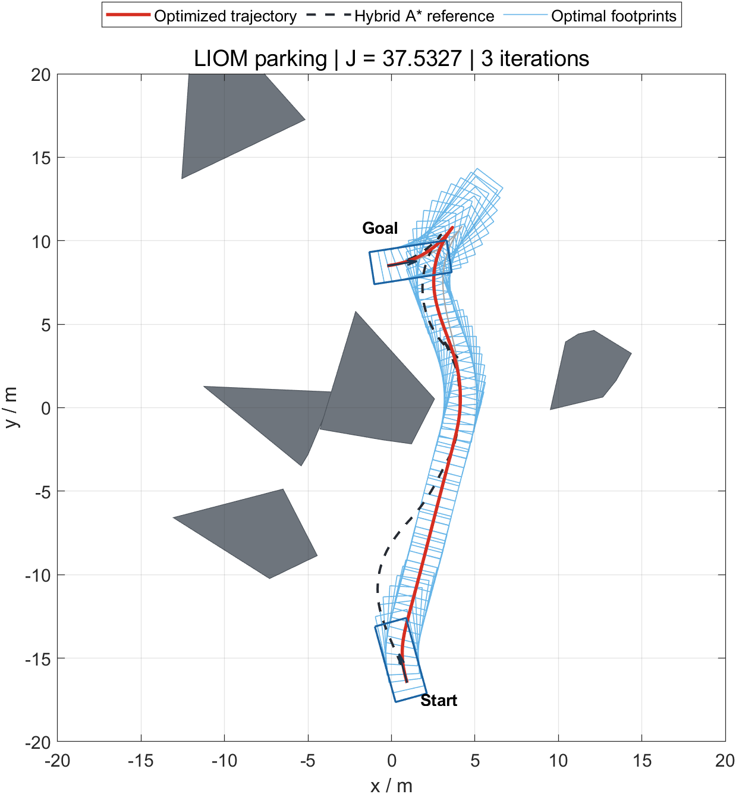
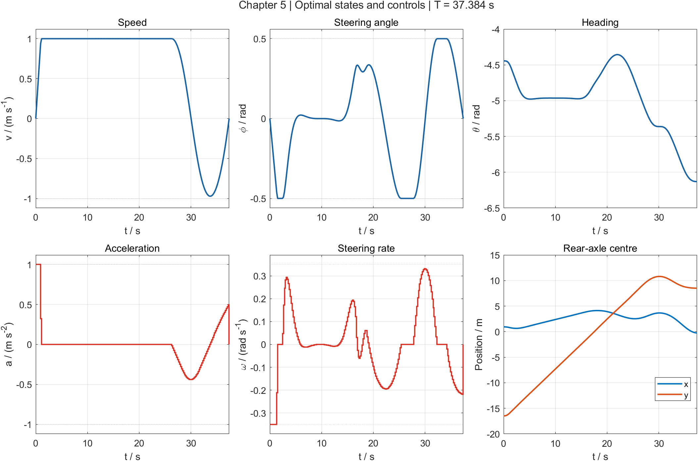
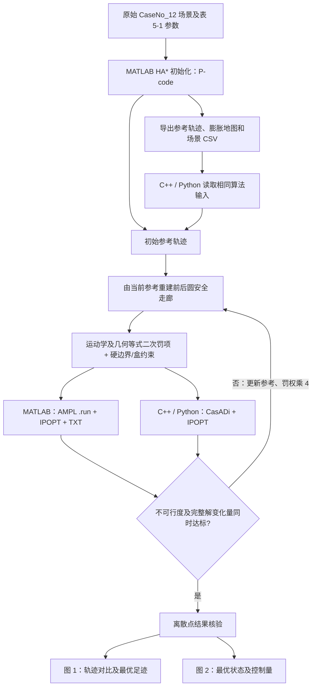

# LIOM2022 · 第五章配套代码

**轻量化迭代优化自主泊车 / Lightweight Iterative Optimization for Autonomous Parking**

本仓库配套中文图书 **《非结构化场景自动驾驶轨迹规划技术》** 第五章《基于轻量化迭代优化的自主泊车轨迹规划鲁棒性增强方法》。请结合书中式 (5-1)～(5-4)、算法 5-1、表 5-1 和图 5-2～5-3 阅读代码。

书名英文译名：*Trajectory Planning Techniques for Autonomous Driving in Unstructured Environments*。**这是一本中文图书，英文名称仅为译名，并非另一本英文版图书。**

提供三个实现：

| 目录 | 求解与初始化 | 运行入口 |
| --- | --- | --- |
| [matlab](matlab/README.md) | P-code 保护的 HA* 搜索；AMPL/IPOPT–MA27；`.run` / TXT 交换数据 | MATLAB 中运行 `RunMe.m` |
| [cpp](cpp/README.md) | 原生 C++ 走廊构造、CasADi/IPOPT 优化；读取随附 HA* 参考轨迹 | 编译后运行 `python runme.py`，或直接运行 `liom` |
| [python](python/README.md) | Python 走廊构造、CasADi/IPOPT 优化；读取随附 HA* 参考轨迹 | `python runme.py` |

C++、Python 的优化计算不调用 MATLAB 或 AMPL。两者随附的数据是算法 5-1 的**初始参考轨迹和场景输入**，每次运行都会重新构造走廊、求解各轮优化问题；未随附预先求好的最优轨迹。HA* 内部实现仅在 MATLAB 中以 P-code 提供。

## 实际运行效果

原始 `CaseNo_12.mat` 示例，200 个配置点，三轮 LIOM 迭代。蓝色足迹先绘制，随后叠加初始轨迹、中间迭代和最优轨迹。每个版本最终只生成两张静态图。





以上图片由本仓库 MATLAB 版实际求解生成。三个版本在本次 Windows 验证中均得到 `J ≈ 37.5327496`、`T ≈ 37.3844018 s`、3 次迭代；最小离散双圆避障间距约 `0.02657 m`。书中图 5-3 的代价为 `37.5320`，本次结果与该值的差约 `0.00075`；求解器版本、收敛精度及文本传值精度可能影响末位数值。

## 与第五章的对应

流程遵循算法 5-1：用当前参考轨迹构造前、后覆盖圆的安全行驶走廊，求解包含运动学与双圆几何等式二次罚项的优化问题，然后用本轮完整解更新参考。只有以下两个条件**同时成立**才停止：

```text
infeasibility < 1e-5
norm(current_solution - previous_solution, 2) < 1.0
```

解向量按 `x, y, theta, v, a, phi, omega, xf, yf, xr, yr, T` 排列，包含全部 200 个配置点上的变量和总时间。未收敛时罚权乘以 4，再重建走廊求解。最多 20 轮是异常退出保护，达到上限会报错，不作为收敛条件。

| 表 5-1 参数 | 本仓库数值 |
| --- | --- |
| 配置点数 / 时间离散 | 200 / 等时间间隔、显式 Euler |
| 轴距、前悬、后悬 | 2.8、0.96、0.929 m |
| 车宽 | 1.942 m |
| 速度、加速度上限（绝对值） | 1 m/s、1 m/s² |
| 前轮转角、转角速率上限（绝对值） | 0.5 rad、0.35 rad/s |
| 加速度、转角速率代价权重 | 0.01、0.01 |
| 走廊扩张步长 | 0.1 m |
| 初始罚权 / 递增系数 | 100000 / 4 |
| 不可行度、解变化量容差 | 1e-5、1.0 |
| 书中线性求解器 | IPOPT + MA27 |

车辆位置以**后轴中心**表示，前、后覆盖圆的圆心距后轴中心分别为 `0.75 L - lr`、`0.25 L - lr`，半径为 `hypot(L/4, width/2)`。边界条件、速度/加速度/转角/转角速率上下界和圆心走廊盒约束保持为硬约束；运动学与内部配置点的双圆几何等式进入二次罚项。端点圆心直接固定为端点位姿对应的几何位置。

数值离散沿用作者提供的原始 AMPL 实验代码：`dt = T/(N-1)`，名义代价为 `T + 0.01*sum(a.^2) + 0.01*sum(omega.^2)`，不可行度为 Euler 等式及双圆几何等式残差的平方和。这些离散求和没有另外乘 `dt`；三个实现采用相同约定。显示的 `J` 是名义代价，求解器实际最小化 `J + penalty_weight*infeasibility`。

本次整理使用完整解向量判断变化量、保留 17 位文本传值精度，并核验求解成功标志，避免读取上次运行残留的解。IPOPT 数值容差设为 `1e-7`，与算法的不可行度阈值 `1e-5` 是不同参数。验证只检查离散配置点，不增加相邻配置点之间的连续碰撞验证。

## 总体架构



## 安装与运行

下载或克隆整个仓库，再按所需版本的安装说明操作：

```bash
git clone https://github.com/libai1943/LIOM2022.git
```

- **MATLAB**：[安装说明与全部主要 M 函数](matlab/README.md)。Windows 64 位、MATLAB R2021b、Navigation Toolbox、Image Processing Toolbox；首次安装 AMPL/IPOPT–MA27 运行文件后，打开 `matlab/RunMe.m` 点击运行。
- **Python**：[环境安装与运行命令](python/README.md)。安装 CasADi、NumPy、Matplotlib；默认使用 MA27，可明确指定 `--linear-solver mumps`。
- **C++**：[CasADi 依赖、CMake 编译与运行](cpp/README.md)。C++17、CMake、带 IPOPT 插件的 CasADi；求解在 C++ 中完成，Python/Matplotlib 只负责两张结果图。

默认 MA27 对应书中设置。MA27/HSL 安装方式见各目录说明；显式选择 MUMPS 时更换的是线性代数后端，模型与 LIOM 参数保持一致，但不称为表 5-1 的 MA27 复现实验。程序不会静默更换线性求解器。

## 文件与结果

| 文件或目录 | 作用 |
| --- | --- |
| `matlab/RunMe.m` | 书籍介绍、引用要求和一键运行入口 |
| `matlab/OptimizeTrajectoryViaLIOM.m`、`matlab/NLP.mod` | 算法 5-1 外层循环及中间优化模型 |
| `matlab/ConstructSafeTravelCorridors.m` | 沿上、左、下、右方向交替扩张走廊 |
| `matlab/AmplInputs/`、`matlab/AmplResults/` | 必需的 TXT 交换目录，以 `.gitkeep` 保留；运行时自动生成数据 |
| `matlab/ExportReferenceData.m` | 导出跨语言版本所需的 HA* 初始数据 |
| `cpp/src/corridor.cpp` | C++ 走廊生成、变量边界与参考向量 |
| `cpp/src/optimizer.cpp` | C++ CasADi 模型、迭代与离散结果检查 |
| `cpp/src/main.cpp` | C++ 命令行、输入读取及结果保存 |
| `python/liom.py` | Python 同一模型、走廊、外层迭代与离散检查 |
| `cpp/plot_results.py`、`python/plot_results.py` | 读取求解结果，仅绘制两张静态图 |
| `cpp/data/`、`python/data/` | 相同的原始场景、地图及 HA* 初始参考数据 |
| `matlab/docs/images/` | README 的两张实际运行效果图 |

MATLAB 在工作区返回 `result`，其中 `iterations` 的列依次为迭代数、罚权、名义代价、不可行度、完整解变化量。C++/Python 将同样的记录和最终变量写入各自 `results/`，并保存 `trajectory.png`、`profiles.png`。`--no-show` 适用于无交互窗口的运行，仍保存两张图。

发布目录中初始化搜索函数仅保留 `SearchTrajectoryViaFTHA.p`、`SearchAStarPath.p`、`ResamplePath.p`，没有同名 M 文件；可视化和 LIOM 主体保持可读。未包含视频生成函数、旧实验图片或临时测试文件。

## 使用与引用

使用本代码开展研究，请引用对应论文，并结合上述中文图书第五章理解方法：

> Li, B., Acarman, T., Zhang, Y., et al. **Optimization-based Trajectory Planning for Autonomous Parking with Irregularly Placed Obstacles: A Lightweight Iterative Framework.** *IEEE Transactions on Intelligent Transportation Systems*, **23**(8): 11970–11981, **2022**. [IEEE 论文页面](https://ieeexplore.ieee.org/document/9344631).

卷期年份为 2022；论文于 2021 年在线发表。仓库名 LIOM2022 对应正式卷期年份。

原仓库版权声明：**Copyright (C) 2025 Bai Li**；原仓库代码许可为 **GNU General Public License v3.0**。GitHub 发布内容不附带第三方求解器 EXE/DLL；请按对应版本的说明安装依赖。AMPL 的授权获取见 [AMPL 官方页面](https://ampl.com/try-ampl/request-a-full-trial/)，HSL/MA27 获取见 [IPOPT 官方说明](https://coin-or.github.io/Ipopt/INSTALL.html#DOWNLOAD_HSL)。

C++ 的 CasADi 接入可同时参考作者的 [CartesianPlanner](https://github.com/libai1943/CartesianPlanner)。本仓库实现本书第五章的静态自主泊车示例。
